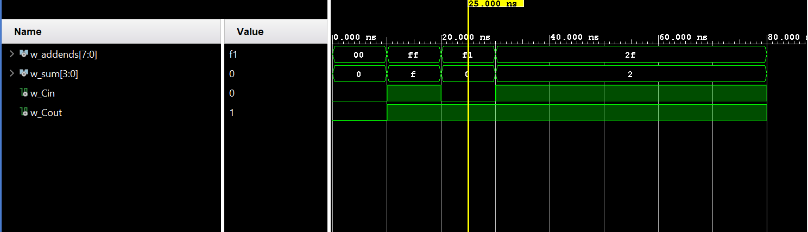

# ECE 281 ICE 3: Ripple-Carry Adder with Top Level Design

## Documentation
I once again used Gen AI level III to review my work. Specifically, I used it to detect several errors in my VHDL for ICEIII, to include this documentation statement and the following issues:
1. Syntax & Hidden "Stealth" Errors
Non-Breaking Space Cleanup: We identified and targeted ASCII 160 characters (non-breaking spaces) that often hide in code copied from web editors and cause the compiler to throw "illegal character" fits.
Port Map Punctuation: We fixed the common mistake of using semicolons (;) inside a port map instead of commas (,), and ensured the final item in the list had no trailing punctuation.
Formal vs. Actual Mapping: I pointed out that the left side of the => must match the component's internal port names, while the right side connects to your architecture's signals or ports.
2. Testbench & Simulation Logic
Signal Initialization: We added initial values (like := '0') to w_Cin and w_Cout to prevent "Uninitialized" ('U') states from breaking your logic at time = 0.
Process Timing: We verified that your wait for 10 ns statements were correctly placed before your assertions to account for gate propagation delay.
Assertion Logic: We double-checked the math for your edge cases (like 15+15+1=31) to ensure your expected hex values (x"F" for the sum and '1' for carry) were mathematically sound.
3. Top-Level FPGA Integration (Basys3)
Bit-Width Mismatch: I caught the error where you tried to map a 4-bit sum into a 3-bit LED slice (led(3 downto 1)), which would have caused a synthesis failure.
Floating Pins: We identified that led(0) was left unassigned, which can lead to unpredictable hardware behavior or implementation errors.
Port Map Legality: We moved concurrent signal assignments (like driving an LED bit) out of the port map block and into the correct architecture body area.
4. Structural Architecture (Ripple-Carry Logic)
Carry-Chain "Daisy Chaining": We validated your structural instantiation of four full adders, ensuring Cout from one bit correctly feeds the Cin of the next bit.
The "Final Carry" Connection: We found the final missing link where the carry out of the 4th adder (w_carry(3)) needed to be explicitly tied to the top-level Cout port to complete the circuit.
The chat can be found here: https://gemini.google.com/share/e8919af304c7. Note that I added specific language to prevent it from writing any code, in accordance with course policy.

